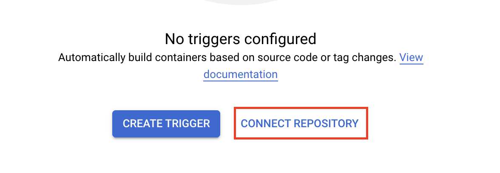
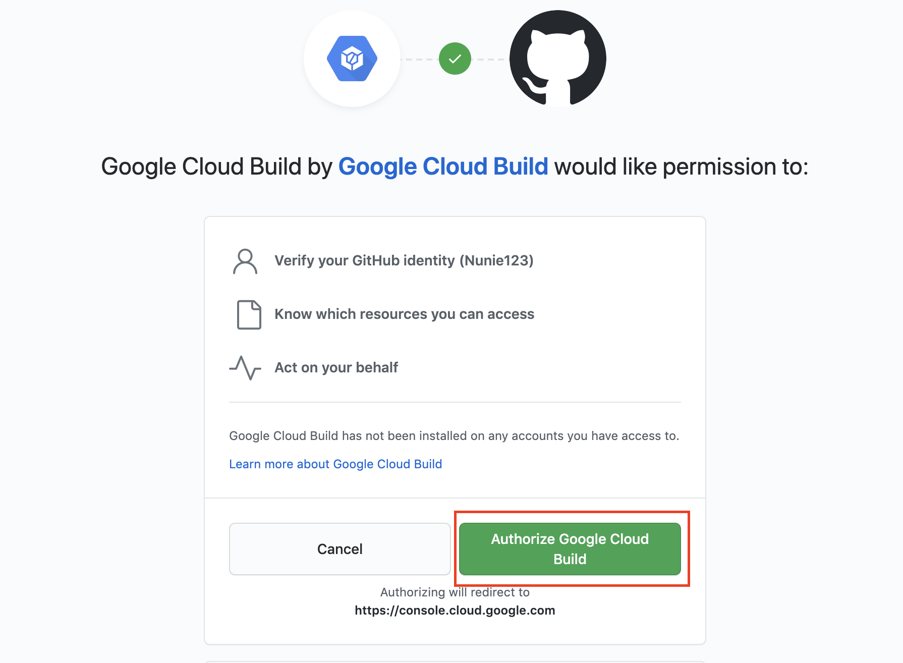
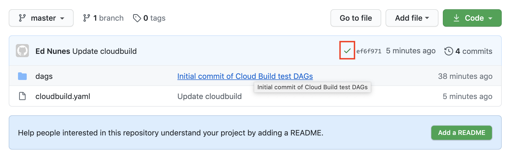
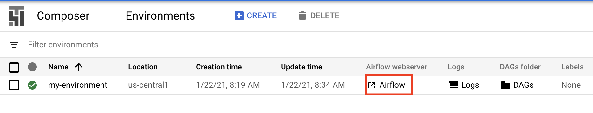
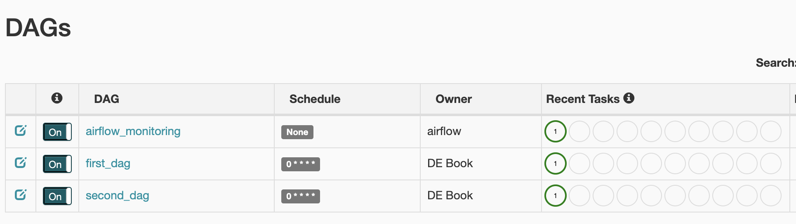
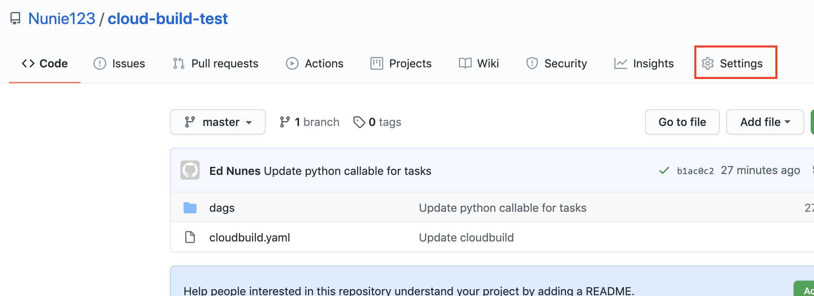
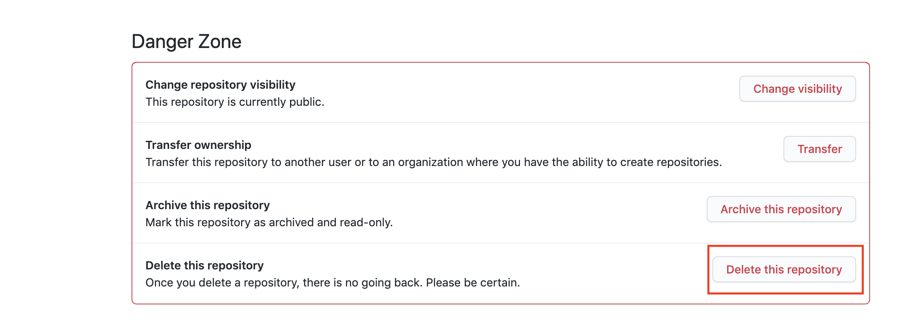

# Up and Running: Data Engineering on the Google Cloud Platform
The completely free E-Book for setting up and running a Data Engineering stack on Google Cloud Platform.

NOTE: This book is currently incomplete. If you find errors or would like to fill in the gaps, read the [Contributions section](https://github.com/Nunie123/data_engineering_on_gcp_book#user-content-contributions).

## Table of Contents
[Preface](https://github.com/Nunie123/data_engineering_on_gcp_book) <br>
[Chapter 1: Setting up a GCP Account](https://github.com/Nunie123/data_engineering_on_gcp_book/blob/master/ch_01_gcp_account.md) <br>
[Chapter 2: Setting up Batch Processing Orchestration with Composer and Airflow](https://github.com/Nunie123/data_engineering_on_gcp_book/blob/master/ch_02_orchestration.md) <br>
[Chapter 3: Building a Data Lake with Google Cloud Storage (GCS)](https://github.com/Nunie123/data_engineering_on_gcp_book/blob/master/ch_03_data_lake.md) <br>
[Chapter 4: Building a Data Warehouse with BigQuery](https://github.com/Nunie123/data_engineering_on_gcp_book/blob/master/ch_04_data_warehouse.md) <br>
[Chapter 5: Setting up DAGs in Composer and Airflow](https://github.com/Nunie123/data_engineering_on_gcp_book/blob/master/ch_05_dags.md) <br>
[Chapter 6: Setting up Event-Triggered Pipelines with Cloud Functions](https://github.com/Nunie123/data_engineering_on_gcp_book/blob/master/ch_06_event_triggers.md) <br>
[Chapter 7: Parallel Processing with Dataproc and Spark](https://github.com/Nunie123/data_engineering_on_gcp_book/blob/master/ch_07_parallel_processing.md) <br>
[Chapter 8: Streaming Data with Pub/Sub](https://github.com/Nunie123/data_engineering_on_gcp_book/blob/master/ch_08_streaming.md) <br>
[Chapter 9: Managing Credentials with Google Secret Manager](https://github.com/Nunie123/data_engineering_on_gcp_book/blob/master/ch_09_secrets.md) <br>
[Chapter 10: Infrastructure as Code with Terraform](https://github.com/Nunie123/data_engineering_on_gcp_book/blob/master/ch_10_infrastructure_as_code.md) <br>
**Chapter 11: Deployment Pipelines with Cloud Build** <br>
[Chapter 12: Monitoring and Alerting](https://github.com/Nunie123/data_engineering_on_gcp_book/blob/master/ch_12_monitoring.md) <br>
[Chapter 13: Up and Running - Building a Complete Data Engineering Infrastructure](https://github.com/Nunie123/data_engineering_on_gcp_book/blob/master/ch_13_up_and_running.md) <br>
[Appendix A: Example Code Repository](https://github.com/Nunie123/data_engineering_on_gcp_book/blob/master/appendix_a_example_code/README.md)


---

# [Chapter 11: Deployment Pipelines with Cloud Build](https://github.com/Nunie123/data_engineering_on_gcp_book/blob/master/ch_11_deployment_pipelines.md): Deployment Pipelines with Cloud Build
We've been talking a lot about data pipelines in this book, but in this chapter we'll be building another type of pipeline: a deployment pipeline.

A deployment pipeline is the series of steps that occur between when a developer wants to put their code in production and when it actually gets there. This is also sometimes called a "build pipeline" or a "CI/CD pipeline". The concept of continuous integration/continuous delivery ("CI/CD"), is often intertwined with a deployment pipeline, but they are distinct. CI/CD is a strategy that allows developers to integrate their code into production whenever it is ready, whereas a deployment pipeline is the tool used to actually get the code into production. The deployment pipeline we are building in this chapter is compatible with a CI/CD strategy. More information on CI/CD is available [here](https://continuousdelivery.com/).

In general terms, we are going to create a deployment pipeline where anytime code is pushed into our master branch a pipeline will run automated tests then deploy the code to GCP.

In this chapter we are going to:
1. Instantiate a Composer (Airflow) instance.
2. Create a GitHub repo and connect it to GCP.
3. Create some DAGs with unit tests.
4. Create a GCP trigger that will test and deploy our DAGs when they our pushed into our repo.
5. Push our code to our repo and watch Cloud Build deploy it on our behalf.


## Instantiate a Composer Instance
As we discussed way back in [Chapter 2](https://github.com/Nunie123/data_engineering_on_gcp_book/blob/master/ch_02_orchestration.md), it can take quite awhile for GCP to build a new Composer instance (called an "environment"), so it's best we start that process now for it to run while we do everything else:
``` bash
> gcloud composer environments create my-environment \
    --location us-central1 \
    --zone us-central1-f \
    --machine-type n1-standard-1 \
    --image-version composer-1.12.2-airflow-1.10.10 \
    --python-version 3 \
    --node-count 3 \
    --service-account composer-dev@de-book-dev.iam.gserviceaccount.com 
```

## Create a GitHub Repo and Connect it to GCP
We'll be using GitHub in this chapter because it is the most popular (and free) code hosting platform. Cloud Build also integrates with BitBucket (still in beta as of 2021-01-20) and GCP's own Cloud Source Repositories.

First, if you don't have a GitHub account you should [create one](https://github.com/join).

Next, let's create a repository. I'm calling mine "cloud-build-test". If you're not familiar with GitHub, instructions are [here](https://docs.github.com/en/github/getting-started-with-github/create-a-repo) for creating a repository.

So now that we have a GitHub repository, let's connect it to GCP. While we generally try to interact with GCP through the command line, we'll need to use the GCP console to connect our GitHub repo. First, we'll got to the [triggers page](https://console.cloud.google.com/cloud-build/triggers) and select our project. Then we'll select "connect repository".



On the next page select "GitHub (Cloud Build GitHub App)" and click "Continue". You will be brought to a GitHub page requesting you confirm you want to grant Google Cloud Build access to your GitHub account. Click the "Authorize Google Cloud Build" button.



Now back in the GCP console you should select the button to install the Cloud Build GitHub app. Select the repository you wish to connect and click the "Connect repository" button. The next page asks if you want to create a trigger. You can click to skip this step. We'll need to get our Composer/Airflow DAGs set up before we can make our trigger.

That's it. Our GitHub repository is now connected to our GCP project.

## Writing our DAGs
If we're going to demonstrate a deployment pipeline we should probably have some code to deploy, so let's write that. We're going to write some DAGs to be deployed to Composer (covered in more detail in [Chapter 5](https://github.com/Nunie123/data_engineering_on_gcp_book/blob/master/ch_05_dags.md)).

Because we'll be deploying to our GitHub repo, we should start by cloning the repo down to our local machine.
``` Bash
> git clone https://github.com/Nunie123/cloud-build-test.git
Cloning into 'cloud-build-test'...
warning: You appear to have cloned an empty repository.
> cd cloud-build-test/
```

Now let's build our file structure and (empty) files:
``` Bash
> touch cloudbuild.yaml
> mkdir dags
> cd dags
> mkdir python_scripts
> mkdir tests
> touch first_dag.py
> touch second_dag.py
> cd python_scripts
> touch first_script.py
> touch second_script.py
> cd ../tests
> touch test_python_scripts.py
```

We now have two DAG files (`first_dag.py`, `second_dag.py`), two Python script files that we'll use in our DAGs (`first_script.py`, `second_script.py`), and one file to run unit tests on our Python scripts (`test_python_scripts.py`). Let's start adding our code to these files.

Here's first_dag.py:
``` Python
# first_dag.py
import datetime

from airflow import DAG
from airflow.operators.python_operator import PythonOperator

from python_scripts import first_script

default_args = {
    'owner': 'DE Book',
    'depends_on_past': False,
    'email': [''],
    'email_on_failure': False,
    'email_on_retry': False,
    'retries': 3,
    'retry_delay': datetime.timedelta(seconds=30),
    'start_date': datetime.datetime(2020, 10, 17),
}

dag = DAG(
    'first_dag',
    schedule_interval="0 0 * * *",   # run every day at midnight UTC
    max_active_runs=1,
    catchup=False,
    default_args=default_args
)


t_run_first_script = PythonOperator(
    task_id="run_first_script",
    python_callable=first_script.count_to_five,
    dag=dag
)
```

And now second_dag.py:
``` Python
# second_dag.py
import datetime

from airflow import DAG
from airflow.operators.python_operator import PythonOperator

from python_scripts import second_script

default_args = {
    'owner': 'DE Book',
    'depends_on_past': False,
    'email': [''],
    'email_on_failure': False,
    'email_on_retry': False,
    'retries': 3,
    'retry_delay': datetime.timedelta(seconds=30),
    'start_date': datetime.datetime(2020, 10, 17),
}

dag = DAG(
    'second_dag',
    schedule_interval="0 0 * * *",   # run every day at midnight UTC
    max_active_runs=1,
    catchup=False,
    default_args=default_args
)


t_run_second_script = PythonOperator(
    task_id="run_second_script",
    python_callable=second_script.say_hello,
    dag=dag
)
```

Let's fill in our first Python script:
``` Python
# first_script.py
def count_to_five():
    count_list = []
    for i in range(1, 6):
        count_list.append(i)
    return count_list
```

And now our second script:
``` Python
# second_script.py
def say_hello():
    message = 'AHOY!'
    return message
```

And finally, we'll create our test file. In this book so far I've decided that for brevity's sake we'll be skipping writing tests for our code. But your production code should absolutely be well tested. I'm including a test file here to demonstrate the good practice of having your deployment pipeline test your code before pushing it into production.
``` Python
# test_python_scripts.py
# run from top level of repo
import unittest
from ..python_scripts import first_script, second_script

class TestScripts(unittest.TestCase):

    def test_first_script(self):
        returned_list = first_script.count_to_five()
        length = len(returned_list)
        last_value = returned_list[-1]
        self.assertEqual(length, 5)
        self.assertEqual(last_value, 5)

    def test_second_script(self):
        returned_value = second_script.say_hello()
        self.assertEqual(returned_value, 'AHOY!')

if __name__ == '__main__':
    unittest.main()
```

Now we can run our unit tests by navigating to the top level of our repo (the `cloud-build-test` folder) and executing:
``` Bash
> python -m unittest tests/test_python_scripts.py
..
----------------------------------------------------------------------
Ran 2 tests in 0.000s

OK
```

We now have a code repository with two DAGs that we want deployed to GCP and two unit tests we want to pass before we allow our code to deploy.

## Create a GCP Trigger
Now let's create a Trigger. This Trigger will kick off a series of Bash commands to test our code, then deploy it to GCP any time our GitHub repo's master branch has been updated. 

To accomplish this we'll first make our Cloud Build configuration file defining the commands we want to run when a change is pushed to the master branch. As you can probably guess just by looking at the file below, we're having Cloud Build take two actions. First, we're having it run our tests, just like we did in the command line above. If that succeeds without raising an error, then we will copy (using `rsync`, discussed in [Chapter 3](https://github.com/Nunie123/data_engineering_on_gcp_book/blob/master/ch_03_data_lake.md) ) the contents of our `dag/` folder into the GCS bucket where our Composer instance looks for DAGs. To find the bucket used for our Composer instance execute:
``` Bash
> gcloud composer environments describe my-environment \
    --location us-central1 \
    --format="get(config.dagGcsPrefix)"
gs://us-central1-my-environment-c4c96098-bucket/dags
```

Now that we know the bucket we need to copy our DAGs to, we can write our Cloud Build file in the top level of our repo:
``` YAML
# cloudbuild.yaml
steps:
- name: 'docker.io/library/python:3.7'
  id: Test
  entrypoint: /bin/sh
  args: [-c, 'python -m unittest dags/tests/test_python_scripts.py']
- name: gcr.io/google.com/cloudsdktool/cloud-sdk
  id: Deploy
  entrypoint: bash
  args: [ '-c', 'gsutil -m rsync -d -r ./dags gs://${_COMPOSER_BUCKET}/dags']
substitutions:
    _COMPOSER_BUCKET: us-central1-my-environment-c4c96098-bucket
```
More information on creating Cloud Build files is available [here](https://cloud.google.com/cloud-build/docs/build-config).

Now we need to deploy our trigger to GCP. We can do that through the command line like so:
``` Bash
> gcloud beta builds triggers create github \
    --repo-name=cloud-build-test \
    --repo-owner=Nunie123 \
    --branch-pattern="master" \
    --build-config=cloudbuild.yaml
```

You may have noticed the `beta` in our gcloud command (if you are prompted to install "beta" components after executing the above command, do so). The `beta` signifies that this `gcloud builds triggers` command utility is still being tested by GCP developers, so should be used with caution (and best avoided in production code). Fortunately, as we discussed in [Chapter 10: Infrastructure as Code with Terraform](https://github.com/Nunie123/data_engineering_on_gcp_book/blob/master/ch_10_infrastructure_as_code.md), we shouldn't be deploying our infrastructure through the command line, anyway. If we we were deploying through Terraform we would just add a resource block to our Terraform file like this:
``` JS
resource "google_cloudbuild_trigger" "filename-trigger" {
  trigger_template {
    branch_name = "master"
    repo_name   = "my-repo"
  }

  substitutions = {
    _FOO = "bar"
    _BAZ = "qux"
  }

  filename = "cloudbuild.yaml"
}
```

Instead of having one file for our Cloud Build configuration and another file for Terraform, it's possible to combine them into a single Terraform file. More details on deploying Triggers with Terraform is available [here](https://registry.terraform.io/providers/hashicorp/google/latest/docs/resources/cloudbuild_trigger).

## Pushing to GitHub

Now that our Trigger is set up, all we have to do is push our code to the master branch of our GitHub repo, and it will run our deployment pipeline:

``` Bash
> git add --all
> git commit -m 'Initial commit of Cloud Build test DAGs'
> git push
```

In a production environment we would not be pushing our code from our local machine into the master branch. Particularly if you are practicing CI/CD, you'll be creating branches, doing pull requests, and merging the branches back into your master branch. This is often referred to as [Git Flow](https://guides.github.com/introduction/flow/).

If we travel to our repo on GitHub (for me it's https://github.com/Nunie123/cloud-build-test), we can see the status of our build process:


The green check mark indicates the deployment was successful (An orange dot means it is in process, and a red "x" means it failed). We can click on the icon to be taken to the GCP Console, where we can view more details about our build.

As a final check, let's take a look at our Airflow UI and make sure our DAGs are there. Head to the [GCP Composer Console](https://console.cloud.google.com/composer/), select your project, then select the link for the Airflow webserver.


We can see that our DAGs are deployed and successfully run:


## Cleaning up
For this chapter we created a Composer Environment, a bucket (created by Composer) for our DAGs, a Cloud Build Trigger, and a GitHub repository. Let's start taking them down.

In this chapter we built our infrastructure using the command line for expedience. If you used Terraform to build your infrastructure (as discussed in [Chapter 10: Infrastructure as Code with Terraform](https://github.com/Nunie123/data_engineering_on_gcp_book/blob/master/ch_10_infrastructure_as_code.md)), the you can run the `terraform destroy` command to take your GCP resources down.

As I've shown in Chapters 2 and 5, we can delete the Composer Environment by running:
``` bash
> gcloud composer environments delete my-environment --location us-central1
```
It may take some time to delete the Composer environment, so you may want to open a new terminal session to clean up the rest while that runs.

We already found the bucket name so we could add it to our cloudbuild.yaml file. Now let's delete it.
``` Bash
> gsutil rm -r gs://us-central1-my-environment-c4c96098-bucket
```

Now for something new in this book, let's find our Trigger's name, then delete it:
``` Bash
> gcloud beta builds triggers list
---
createTime: '2021-01-23T14:15:19.273898053Z'
filename: cloudbuild.yaml
github:
  name: cloud-build-test
  owner: Nunie123
  push:
    branch: master
id: 53042473-7323-471d-817d-a8e59939d84a
name: trigger
> gcloud beta builds triggers delete trigger
```

Finally, we have our GitHub repository. We're going to need a GitHub repository for the next chapter, so feel free to leave this repo up if you'd like to reuse it.

If you decide to delete it, you'll need to go to your repo's URL (e.g. https://github.com/Nunie123/cloud-build-test) and click on the "Settings" tab.


When you scroll to the bottom of the settings page you'll see the button to delete the repository. You'll see all sorts of warnings, because deleting code by accident is a very bad thing. But if you're confident you won't need this repository anymore then go ahead and click the "Delete this repository" button and follow the prompts.


---

Next Chapter: [Chapter 12: Monitoring and Alerting](https://github.com/Nunie123/data_engineering_on_gcp_book/blob/master/ch_12_monitoring.md)