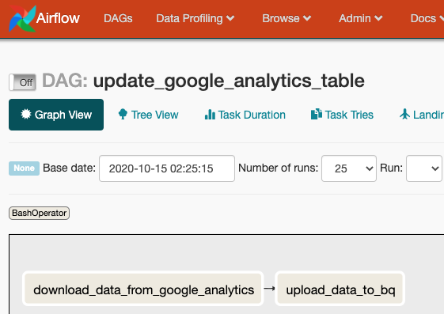
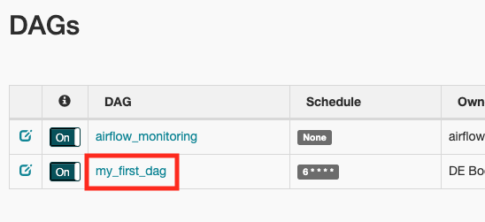

# Up and Running: Data Engineering on the Google Cloud Platform
The completely free E-Book for setting up and running a Data Engineering stack on Google Cloud Platform.

NOTE: This book is currently incomplete. If you find errors or would like to fill in the gaps, read the [Contributions section](https://github.com/Nunie123/data_engineering_on_gcp_book#user-content-contributions).

## Table of Contents
[Preface](https://github.com/Nunie123/data_engineering_on_gcp_book) <br>
[Chapter 1: Setting up a GCP Account](https://github.com/Nunie123/data_engineering_on_gcp_book/blob/master/ch_1_gcp_account.md) <br>
**Chapter 2: Setting up Batch Processing Orchestration with Composer and Airflow** <br>
[Chapter 3: Building a Data Lake with Google Cloud Storage (GCS)](https://github.com/Nunie123/data_engineering_on_gcp_book/blob/master/ch_3_data_lake.md) <br>
[Chapter 4: Building a Data Warehouse with BigQuery](https://github.com/Nunie123/data_engineering_on_gcp_book/blob/master/ch_4_data_warehouse.md) <br>
[Chapter 5: Setting up DAGs in Composer and Airflow](https://github.com/Nunie123/data_engineering_on_gcp_book/blob/master/ch_5_dags.md) <br>
[Chapter 6: Setting up Event-Triggered Pipelines with Cloud Functions](https://github.com/Nunie123/data_engineering_on_gcp_book/blob/master/ch_6_event_triggers.md) <br>
[Chapter 7: Parallel Processing with Dataproc and Spark](https://github.com/Nunie123/data_engineering_on_gcp_book/blob/master/ch_7_parallel_processing.md) <br>
[Chapter 8: Streaming Data with Pub/Sub](https://github.com/Nunie123/data_engineering_on_gcp_book/blob/master/ch_8_streaming.md) <br>
[Chapter 9: Managing Credentials with Google Secret Manager](https://github.com/Nunie123/data_engineering_on_gcp_book/blob/master/ch_9_secrets.md) <br>
[Chapter 10: Infrastructure as Code with Terraform](https://github.com/Nunie123/data_engineering_on_gcp_book/blob/master/ch_10_infrastructure_as_code.md) <br>
[Chapter 11: Deployment Pipelines with Cloud Build](https://github.com/Nunie123/data_engineering_on_gcp_book/blob/master/ch_11_deployment_pipelines.md) <br>
[Chapter 12: Monitoring and Alerting](https://github.com/Nunie123/data_engineering_on_gcp_book/blob/master/ch_12_monitoring.md) <br>
[Chapter 13: Up and Running - Building a Complete Data Engineering Infrastructure](https://github.com/Nunie123/data_engineering_on_gcp_book/blob/master/ch_13_up_and_running.md) <br>
[Appendix A: Example Code Repository](https://github.com/Nunie123/data_engineering_on_gcp_book/blob/master/appendix_a_example_code/README.md)


---

# Chapter 2: Setting up Batch Processing Orchestration with Composer and Airflow

## Apache Airflow Overview

Apache Airflow is a widely used open-source tool for orchestrating data pipelines written in Python. Airflow has a lot of great features, but two things it's particularly handy for is: 
1. Allowing you to schedule data processing jobs.
2. Organize dependencies for your data processing job.

Scheduling can be a trickier problem than it seems. What happens if a job isn't finished before it is scheduled to run again? What happens when the scheduling application is down at the time a job is scheduled. What if you realize you have a bug in your data processing code, and you need to reprocess all of your data for your scheduled runs for the last month? Airflow's scheduling has answers and configuration options for these sorts of scheduling problems. It's worth noting that GCP has a dedicated scheduling service, called [Cloud Scheduler](https://cloud.google.com/scheduler), but Airflow works better for our needs.

Managing processing dependencies is a big part of creating a robust data pipeline (this is distinct from environment dependencies, such as whether Python is installed on your machine). 

If we're moving data from the Google Analytics API to a BigQuery table we know that we better download that data first before we try to load it into BigQuery. One way to manage this dependency is within our code, and every time we want this data updated we run our script. But suppose it takes an hour to download the data, and 5 minutes to upload it to BigQuery. If the script fails during the upload then you may be stuck running the whole script again, waiting another hour to download data that's already on your local disk. Alternatively, you could go about developing custom error handling for each of your pipelines that allows it to be restarted in pieces. If you've got a lot of pipelines, that means a lot of code to write and maintain.

Airflow addresses this problem through the use of "Tasks", which are chunks of work that Airflow manages. These Tasks are organized into a Directed Acyclic Graph (DAG), which is a group of Tasks with dependencies defined between these Tasks. So you might have a DAG called "update_google_analytics_table" that has two Tasks: "download_data_from_google_analytics" and "upload_data_to_bq". We can tell airflow that "download_data_from_google_analytics" must complete successfully before "upload_data_to_bq" is run, and if either Task fails Airflow is to retry running the Task. After a designated number of retries, if the Task still has not succeeded it will mark itself as failed (in Chapter 13 we'll discuss setting up alerts for these failures).

Another nice feature of Airflow is that it has a browser-based GUI that is useful for managing and monitoring your DAGs.<br>


Whole [books](https://www.manning.com/books/data-pipelines-with-apache-airflow) have been written about Apache Airflow, and we've only scratched the surface. But this chapter is just focused on configuring Airflow to run, we'll revisit Airflow in Chapter 5, where we'll discuss programming DAGs to run your data pipelines.

## Google Cloud Composer Overview

Cloud Composer is Google's fully managed Airflow service. So rather than renting compute instances and installing Airflow yourself, Composer manages the compute instances for you under the hood. 

While offloading some of DevOps work to GCP is nice, it does provide a complication: Because GCP is a managed service, you are not able to run it locally. So your options are to create a composer instance on GCP for every developer, or set up a dockerized Airflow instance to run locally for development.

The rest of this chapter will be dedicated to setting up your own Cloud Composer instance on GCP.

## Setting up Cloud Composer on GCP
Apache Airflow, whether installed yourself or managed by GCP, requires a collection of infrastructure pieces that coordinate to make the application work. GCP calls an Airflow instance an "Environment" because what you are launching is the environment for all these pieces to work together. Cloud Composer uses the following GCP services to run: Cloud SQL, App Engine, Cloud Storage, Kubernetes Engine, Cloud Logging, Cloud Monitoring, and Pub/Sub. Fortunately GCP handles all that infrastructure for us.

It's also important to be aware that unlike some other services by GCP, Composer does not auto-scale. You are required to designate the number and size of the machines you want to use, with more compute power assigned meaning an increased bill from GCP. If you need to change your assigned compute power you must do so manually.

### Creating the Composer Instance
In Chapter 1 I discussed installing the GCP command line tools. You'll need them for this section.

You're first step is to enable Cloud Composer, which you can do [here](https://console.cloud.google.com/flows/enableapi?apiid=composer.googleapis.com). Select your Project from the drop-down and click "Continue". You'll be taken to a page prompting you to set up your credentials. GCP is reminding you that you should set up a Service Account that will allow you to access the Composer API that you just enabled. We already set up our Service Account in Chapter 1, but now we can grant the Service Account permission to set up a Composer Environment:
``` bash
> gcloud projects add-iam-policy-binding 'de-book-dev' \
    --member='serviceAccount:composer-dev@de-book-dev.iam.gserviceaccount.com' \
    --role='roles/composer.worker'
```

As stated above, a Composer "Environment" is equivalent to a managed Airflow instance. You create an Environment through the [console](https://console.cloud.google.com/composer/environments/create) and through the `gcloud` utility. In Chapter 11 I will go over managing your GCP infrastructure with Terraform, including managing Composer Environments.

We can create a Composer Environment with the following command (WARNING: it can take up to a half hour to create the Environment):
``` bash
> gcloud composer environments create my-dev-environment \
    --location us-central1 \
    --zone us-central1-f \
    --machine-type n1-standard-1 \
    --image-version composer-1.12.2-airflow-1.10.10 \
    --python-version 3 \
    --node-count 3 \
    --service-account composer-dev@de-book-dev.iam.gserviceaccount.com 
```
I've specified a few common options, but there are many more options that you can read about [here](https://cloud.google.com/composer/docs/how-to/managing/creating?authuser=1#gcloud).

To verify your Environment is running you can execute:
``` bash
> gcloud composer environments list --locations us-central1
┌────────────────────┬─────────────┬─────────┬──────────────────────────┐
│        NAME        │   LOCATION  │  STATE  │       CREATE_TIME        │
├────────────────────┼─────────────┼─────────┼──────────────────────────┤
│ my-dev-environment │ us-central1 │ RUNNING │ 2020-10-16T04:04:19.264Z │
└────────────────────┴─────────────┴─────────┴──────────────────────────┘
> gcloud composer environments describe my-dev-environment --location us-central1
```

### Testing a DAG
The point of the Airflow instance is to orchestrate your DAGs, which is how you'll organize your batch data processing. I'll be talking a lot more about how to make DAGs in Chapter 5 (after we talk about GCS and BigQuery), but I'll go over a quick example here.

A DAG is defined in a Python file that Airflow monitors and executes when scheduled. We'll create a DAG that has two tasks: one task will download a list of (mock) products and the other task will print a message indicating the task completed. In Chapter 11 I will discuss how to automate the deployment of these files to GCP, where they will run, but for now we can do that manually. So let's make our Python file:
``` python
# my_first_dag.py

import requests
import datetime

from airflow import DAG
from airflow.operators.bash_operator import BashOperator
from airflow.operators.python_operator import PythonOperator

default_args = {
    'owner': 'DE Book',
    'depends_on_past': False,
    'email': [''],
    'email_on_failure': False,
    'email_on_retry': False,
    'retries': 3,
    'retry_delay': datetime.timedelta(seconds=30),
    'start_date': datetime.datetime(2020, 10, 17),
}

dag = DAG(
    'my_first_dag',
    schedule_interval="6 * * * *",   # run every day at 6am UTC
    max_active_runs=1,
    catchup=False,
    default_args=default_args
)


# A function to download product data from a web API.
def get_product_data() -> str:
    url = 'https://gorest.co.in/public-api/products'
    result = requests.get(url)
    data = result.json()
    products = data['data']
    return f'We downloaded {len(products)} products!'


# A task to download product data from a web API. 
t_get_product_data = PythonOperator(
    task_id='get_product_data',
    python_callable=get_product_data,
    dag=dag
)


# A task to print that the product data has been downloaded.
t_print_message = BashOperator(
    task_id='print_message',
    bash_command='echo "Product data has been downloaded. Congrats on your first DAG!!!!!!!"',
    dag=dag
)


# Setting the first task as a dependency for the second task.
t_print_message.set_upstream(t_get_product_data)


# In a more realistic DAG we would be saving this data to GCS, then updating BigQuery. 
# We'll dive deeper into building DAGs in Chapter 5.
```
Now we need to put our DAG file where our Composer Environment can find it. GCP handles this by sticking all of the DAGs in a GCS bucket. We can find the bucket by running:
``` bash
> gcloud composer environments describe my-dev-environment \
    --location us-central1 \
    --format="get(config.dagGcsPrefix)"
gs://us-central1-my-dev-environm-63db6d2e-bucket/dags
```
You can access the bucket with your DAGs just like any other bucket (we talk more about GCS in Chapter 3), but we don't actually need to access the bucket directly to add our DAG. Instead we can use the command:
``` bash
> gcloud composer environments storage dags import \
    --environment my-dev-environment \
    --location us-central1 \
    --source my_first_dag.py
```

Now lets view the Airflow web interface so we can see our DAG running. We can see the address by running:
``` bash
> gcloud composer environments describe my-dev-environment \
    --location us-central1 | \
    --format="get(config.airflowUri)"
```
Copy that address to your browser, and authenticate if required. We'll talk more about the Airflow web interface in Chapter 5. For now lets click on "my_first_dag".



From here we can see that our tasks completed successfully.

## Cleaning Up
GCP charges us for using the services we set up in this chapter. We will be using this Composer Environment again in Chapter 5, so if you don't feel like setting it up again you can keep it running. Just be aware of your costs for [Composer](https://cloud.google.com/composer/pricing) and [GCS](https://cloud.google.com/storage/pricing). When we set up our Composer Environment GCP also set up resources in GCS for us, which is convenient for setting Airflow up. We just have to remember we have more to shut down than Composer when we are cleaning up.

We can delete the Composer Environment by running:
``` bash
> gcloud composer environments delete my-dev-environment --location us-central1
```

I already provided the command for finding the related bucket above. You can also find it by looking through all your buckets for the one named after your Composer Environment:
``` bash
> gsutil list
gs://us-central1-my-dev-environm-63db6d2e-bucket/
```
Now we can delete the bucket with:
``` bash
> gsutil rm -r gs://us-central1-my-dev-environm-63db6d2e-bucket/
```

---

Next Chapter: [Chapter 3: Building a Data Lake with Google Cloud Storage (GCS)](https://github.com/Nunie123/data_engineering_on_gcp_book/blob/master/ch_3_data_lake.md)