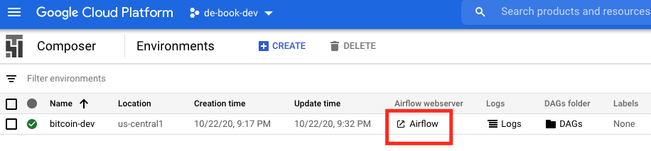
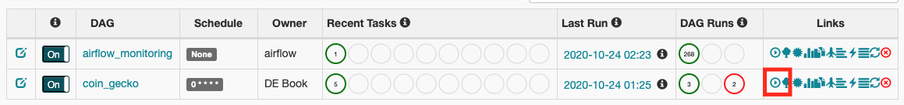
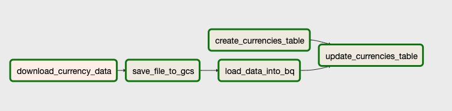
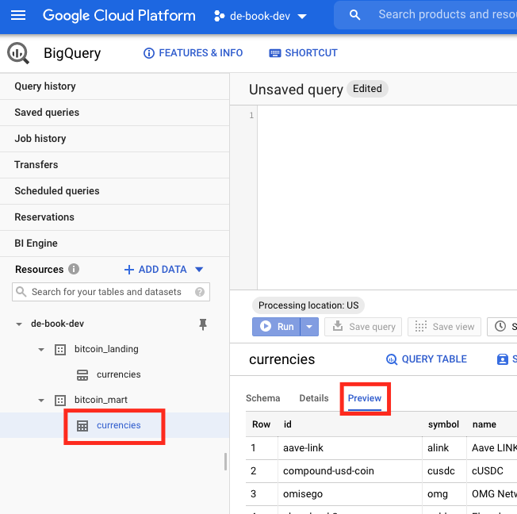

# Up and Running: Data Engineering on the Google Cloud Platform
The completely free E-Book for setting up and running a Data Engineering stack on Google Cloud Platform.

NOTE: This book is currently incomplete. If you find errors or would like to fill in the gaps, read the [Contributions section](https://github.com/Nunie123/data_engineering_on_gcp_book#user-content-contributions).

## Table of Contents
[Preface](https://github.com/Nunie123/data_engineering_on_gcp_book) <br>
[Chapter 1: Setting up a GCP Account](https://github.com/Nunie123/data_engineering_on_gcp_book/blob/master/ch_1_gcp_account.md) <br>
[Chapter 2: Setting up Batch Processing Orchestration with Composer and Airflow](https://github.com/Nunie123/data_engineering_on_gcp_book/blob/master/ch_2_orchestration.md) <br>
[Chapter 3: Building a Data Lake with Google Cloud Storage (GCS)](https://github.com/Nunie123/data_engineering_on_gcp_book/blob/master/ch_3_data_lake.md) <br>
[Chapter 4: Building a Data Warehouse with BigQuery](https://github.com/Nunie123/data_engineering_on_gcp_book/blob/master/ch_4_data_warehouse.md) <br>
**Chapter 5: Setting up DAGs in Composer and Airflow** <br>
[Chapter 6: Setting up Event-Triggered Pipelines with Cloud Functions](https://github.com/Nunie123/data_engineering_on_gcp_book/blob/master/ch_6_event_triggers.md) <br>
[Chapter 7: Parallel Processing with DataProc and Spark](https://github.com/Nunie123/data_engineering_on_gcp_book/blob/master/ch_7_parallel_processing.md) <br>
Chapter 8: Streaming Data with Pub/Sub <br>
Chapter 9: Managing Credentials with Google Secret Manager <br>
Chapter 10: Creating a Local Development Environment <br>
Chapter 11: Infrastructure as Code with Terraform <br>
Chapter 12: Continuous Integration with Jenkins <br>
Chapter 13: Monitoring and Alerting <br>
Appendix A: Example Code Repository


---

# Chapter 5: Setting up DAGs in Composer and Airflow 

In previous chapters we focused on specific technologies: Composer, GCS, and BigQuery. In this chapter we'll be pulling together everything we've learned to build a realistic data pipeline. We're going to be setting up a Data Warehouse to allow our users to analyze cryptocurrency data. We'll be building a DAG to pull data into our Data Lake from a web API. We'll then be moving our data into BigQuery. Finally, we'll be running transformations on our data so that it is easy for our users wrangle.

## Initializing the GCP Infrastructure
For this chapter we are going to need a Composer Environment, a GCS Bucket, and a couple BigQuery Datasets. In Chapter 11 I'll show how to manage each of these pieces of infrastructure in your code using Terraform. But for now, we're going to set them up using the command line tools.

First, we need to make sure GCP uses our service account:
``` bash
> export GOOGLE_APPLICATION_CREDENTIALS="/path/to/keys/de-book-dev.json"
```

The Composer Environment can take a good while to spin up after we issue the command, so we'll start that first:
``` bash
> gcloud composer environments create bitcoin-dev \
>   --location us-central1 \
>   --zone us-central1-f \
>   --machine-type n1-standard-1 \
>   --image-version composer-1.12.2-airflow-1.10.10 \
>   --python-version 3 \
>   --node-count 3 \
>   --service-account composer-dev@de-book-dev.iam.gserviceaccount.com 
```
For more details on setting up a Composer Environment check out Chapter 2.

Now let's create our GCS Buckets:
``` bash
> gsutil mb gs://de-book-bitcoin-web-data
```

Finally, let's create our BigQuery Datasets:
``` bash
> bq mk --dataset bitcoin_landing
> bq mk --dataset bitcoin_mart
```
The "bitcoin_landing" Dataset will be where we will load our data from GCS. The "bitcoin_mart" Dataset with be where we expose our transformed data to our users. 

While we're waiting for our Composer Environment to finish building we can start working on our DAGs.

## CoinGecko Data Pipeline
CoinGecko provides numerous free web API endpoints providing data on cryptocurrency. We are going to be getting data from their `/coins/markets` endpoint to get information about the top 100 currencies they track. The response is in standard JSON format, so we'll convert that to JSON Lines format, then save it in GCS. Finally, we'll load the data into BigQuery and remove duplicate records. You've already seen how to do almost every part of this pipeline in Chapters 1-3, this will just be bringing it all together.

### Creating the Tasks
As I described in Chapter 2, Airflow manages a series of Tasks that do the work in your pipeline. Here I've chosen to break this pipeline into five Tasks:
1. Download and save the source data.
2. Copy the file to GCS.
3. Load the data into BigQuery.
4. Create the table to be exposed to users.
5. Load the data into the final table.

There are no strict rules on how to break up the work. One of the main benefits of using Airflow is the ability to break a pipeline down into discrete Tasks, so it is generally a good idea to keep the Tasks small.

#### Task 1: Download and Save the Source Data
In this Task we will make a GET request to the web API, then save the returned JSON data as a JSON Lines file. We're using the PythonVirtualenvOperator, which allows us to execute a Python function from within a virtual environment. We need the virtual environment to import the `pandas` and `requests` libraries. We're using `requests` to make the HTTP request, and we're using `pandas` to convert the data to a JSON Lines file. In this step we're saving the file locally, which Composer has mapped to a GCS Bucket.
``` python
filename = 'coin_gecko.json'
filepath = f'/home/airflow/gcs/data/{filename}'

def download_currency_data(filename: str) -> None:
    import pandas as pd     # importing within the function is required for PythonVirtualenvOperator
    import requests
    url = 'https://api.coingecko.com/api/v3/coins/markets?vs_currency=usd&order=market_cap_desc&per_page=100&page=1&sparkline=false'
    result = requests.get(url)
    result.raise_for_status()   # raise an exception if bad response returned
    data = result.json()
    df = pd.DataFrame(data)
    df.to_json(filename, orient='records', lines=True)  # saving as JSON Lines file

t_download_currency_data = PythonVirtualenvOperator(
    Task_id="download_currency_data",
    python_version="3",
    requirements=["requests==2.7.0", "pandas==1.1.3"],
    python_callable=download_currency_data,
    op_kwargs={"filename": filepath},
    dag=dag,
)
```

#### Task 2: Copy the File to GCS
Now that we have the file saved "locally", we need to move it to the designated GCS folder that will act as our Data Lake. We are putting the file inside the "de-book-bitcoin-web-data" Bucket we created above. 

We're using the strange syntax `{{{{ ds_nodash }}}}` in the path name. This refers to an Airflow [macro](https://airflow.apache.org/docs/stable/macros-ref.html), which is basically string interpolation within the Airflow DAG context. In this case, it is being used to provide the execution date of the DAG in the format YYYMMDD. While using Python's `datetime.date.today()` can be useful in some circumstances, it can also be problematic as it is evaluated at the time each Task is run. So if there is a date change between one Task and the next your value for today's date will change. Using the DAG execution date can be tricky, too, as the execution date for a manually run DAG is surprisingly different than when the DAG is executed on a schedule. All that is to say: if you need to dynamically generate a date for a Task, be thoughtful and careful.
``` python
t_save_file_to_gcs = BashOperator(
    task_id="save_file_to_gcs",
    bash_command=f"gsutil cp {filepath} gs://de-book-bitcoin-web-data/coingecko/dt={{{{ ds_nodash }}}}/coin_gecko_{time.time()}.json",
    dag=dag
)
t_save_file_to_gcs.set_upstream(t_download_currency_data)
```
We're using the `set_upstream()` method after each Task to define Task dependencies.

#### Task 3: Load the Data into BigQuery
As I mentioned in Chapter 4, the `bq load` command can be used to create a table if one does not already exist. So we do not need to create a separate Task for creating the table. However, we'll still need to specify a schema:
``` json
[
    {
        "name": "id",
        "type": "STRING",
        "mode": "REQUIRED"
    },
    {
        "name": "symbol",
        "type": "STRING",
        "mode": "NULLABLE"
    },
    {
        "name": "name",
        "type": "STRING",
        "mode": "NULLABLE"
    },
    {
        "name": "image",
        "type": "STRING",
        "mode": "NULLABLE"
    },
    {
        "name": "current_price",
        "type": "FLOAT64",
        "mode": "NULLABLE"
    },
    {
        "name": "market_cap",
        "type": "INT64",
        "mode": "NULLABLE"
    },
    {
        "name": "market_cap_rank",
        "type": "INT64",
        "mode": "NULLABLE"
    },
    {
        "name": "fully_diluted_valuation",
        "type": "FLOAT64",
        "mode": "NULLABLE"
    },
    {
        "name": "total_volume",
        "type": "INT64",
        "mode": "NULLABLE"
    },
    {
        "name": "high_24h",
        "type": "FLOAT64",
        "mode": "NULLABLE"
    },
    {
        "name": "low_24h",
        "type": "FLOAT64",
        "mode": "NULLABLE"
    },
    {
        "name": "price_change_24h",
        "type": "FLOAT64",
        "mode": "NULLABLE"
    },
    {
        "name": "price_change_percentage_24h",
        "type": "FLOAT64",
        "mode": "NULLABLE"
    },
    {
        "name": "market_cap_change_24h",
        "type": "FLOAT64",
        "mode": "NULLABLE"
    },
    {
        "name": "market_cap_change_percentage_24h",
        "type": "FLOAT64",
        "mode": "NULLABLE"
    },
    {
        "name": "circulating_supply",
        "type": "FLOAT64",
        "mode": "NULLABLE"
    },
    {
        "name": "total_supply",
        "type": "FLOAT64",
        "mode": "NULLABLE"
    },
    {
        "name": "max_supply",
        "type": "FLOAT64",
        "mode": "NULLABLE"
    },
    {
        "name": "ath",
        "type": "FLOAT64",
        "mode": "NULLABLE"
    },
    {
        "name": "ath_change_percentage",
        "type": "FLOAT64",
        "mode": "NULLABLE"
    },
    {
        "name": "ath_date",
        "type": "TIMESTAMP",
        "mode": "NULLABLE"
    },
    {
        "name": "atl",
        "type": "FLOAT64",
        "mode": "NULLABLE"
    },
    {
        "name": "atl_change_percentage",
        "type": "FLOAT64",
        "mode": "NULLABLE"
    },
    {
        "name": "atl_date",
        "type": "TIMESTAMP",
        "mode": "NULLABLE"
    },
    {
        "name": "roi",
        "type": "RECORD",
        "mode": "REPEATED",
        "fields": [
            {
                "name": "times",
                "type": "FLOAT64",
                "mode": "NULLABLE"
            }, 
            {
                "name": "currency",
                "type": "STRING",
                "mode": "NULLABLE"
            }, 
            {
                "name": "percentage",
                "type": "FLOAT64",
                "mode": "NULLABLE"
            }
        ]
    },
    {
        "name": "last_updated",
        "type": "TIMESTAMP",
        "mode": "NULLABLE"
    }
   
]
```
We'll set up our table to be partitioned by the `last_updated` field, so that it will be easy to filter our data by the date it was updated. The web API is supposed to update once per day, and our DAG runs once per day, so in theory we shouldn't be getting any duplicates. In practice, we need to plan for the possibility that we have duplicate data getting into our `bitcoin_landing.currencies` table. That'll be taken care of in the final Task. 

Now let's load our data:
``` python
t_load_data_into_bq = BashOperator(
    task_id="load_data_into_bq",
    bash_command=f"""
        bq load \\
           --source_format=NEWLINE_DELIMITED_JSON \\
           --time_partitioning_type=DAY \\
           --time_partitioning_field last_updated \\
           bitcoin_landing.currencies \\
           "gs://de-book-bitcoin-web-data/coingecko/dt={{{{ ds_nodash }}}}/*.json" \\
           /home/airflow/gcs/dags/schemas/coin_gecko_schema.json
    """,
    dag=dag
)
t_load_data_into_bq.set_upstream(t_save_file_to_gcs)
```
When designating the source location we use `*.json` to indicate we will be loading all JSON files in that sub-folder in this operation. While we would usually only expect a single file in there, it's possible multiple source files will be generated in a single day. We don't have to worry about loading the data multiple times, because we're already removing duplicate entries as part of our pipeline in the final Task. We can't specify the specific filename in this Task because it was dynamically generated in the previous Task using the `time.time()` function. If we tried to reference the file name again using the `time.time()` function the file name will change, and this `bq load` will be unable to find the source file.


#### Task 4: Create the Destination Table
In Task 3 when we loaded the data into BigQuery we didn't create the table first because the `bq load` operation took care of table creation for us. For the `bitcoin_mart.currencies` table we are creating the table first, because the final Task to remove duplicate entries will require SQL code that references this table. If the table doesn't exist first then the query will fail, and so will the Task. While this is only an issue on the first time the fifth Task is run, having the table creation Task in the DAG does no harm, even if it's not needed on subsequent runs. The `--force` flag is used to ignore errors if the table already exists (i causes BigQuery to ignore the `bq mk` command).

Note that we're not using the `set_upstream()` method for this Task. This Task can be run independently of the other Tasks, so it does not depend on any other Tasks being complete first.
``` python
t_create_currencies_table = BashOperator(
    task_id="create_currencies_table",
    bash_command="""
        bq mk \\
            --force \\
            bitcoin_mart.currencies \\
            /home/airflow/gcs/dags/schemas/coin_gecko_schema.json
    """,
    dag=dag
)
```

#### Task 5: Load Data into the Final Table
The `currencies` table that we are exposing to our users shouldn't have duplicate records in it. We can remove the duplicates with a simple SQL query:
``` sql
with numbered as (
select *,
  row_number() over(partition by id order by last_updated desc) as rn
from bitcoin_landing.currencies
)
select * except(rn)
from numbered
where rn=1;
```

Now we just need to create our final table based on that query:
``` python
t_update_currencies_table = BashOperator(
    task_id="update_currencies_table",
    bash_command="""
    cat /home/airflow/gcs/dags/sql/bitcoin_mart/currencies.sql | bq --headless query \\
        --destination_table=bitcoin_mart.currencies \\
        --use_legacy_sql=false \\
        --replace
    """,
    dag=dag
)
t_update_currencies_table.set_upstream([t_create_currencies_table, t_load_data_into_bq])
```
Note that we have set both the third and fourth Tasks as dependencies for this final Task.

### Organizing the DAG
Now that we've got our Tasks straightened out, the last piece of code is the instantiation of the DAG:
``` python
default_args = {
    'owner': 'DE Book',
    'depends_on_past': False,
    'email': [''],
    'email_on_failure': False,
    'email_on_retry': False,
    'retries': 3,
    'retry_delay': datetime.timedelta(seconds=30),
    'start_date': datetime.datetime(2020, 10, 17),
}

dag = DAG(
    'coin_gecko',
    schedule_interval="0 * * * *",      # run every day at midnight UTC
    max_active_runs=1,                  # only let 1 instance run at a time
    catchup=False,                      # if a scheduled run is missed, skip it
    default_args=default_args
)
```
The `schedule_interval="0 * * * *"` refers to how often it should run, using [cron syntax](https://devhints.io/cron). Also note that if a Task fails in this DAG, Airflow will re-run the Task three times before marking the Task as failed.

Now we have all the pieces. This is what our entire DAG file looks like:
``` python
import time
import datetime

from airflow import DAG
from airflow.operators.bash_operator import BashOperator
from airflow.operators.python_operator import PythonVirtualenvOperator

default_args = {
    'owner': 'DE Book',
    'depends_on_past': False,
    'email': [''],
    'email_on_failure': False,
    'email_on_retry': False,
    'retries': 3,
    'retry_delay': datetime.timedelta(seconds=30),
    'start_date': datetime.datetime(2020, 10, 17),
}

dag = DAG(
    'coin_gecko',
    schedule_interval="0 * * * *",   # run every day at midnight UTC
    max_active_runs=1,
    catchup=False,
    default_args=default_args
)
filename = 'coin_gecko.json'
filepath = f'/home/airflow/gcs/data/{filename}'


def download_currency_data(filename: str) -> None:
    import pandas as pd     # importing within the function is required for PythonVirtualenvOperator
    import requests
    url = 'https://api.coingecko.com/api/v3/coins/markets?vs_currency=usd&order=market_cap_desc&per_page=100&page=1&sparkline=false'
    result = requests.get(url)
    result.raise_for_status()   # raise an exception if bad response returned
    data = result.json()
    df = pd.DataFrame(data)
    df.to_json(filename, orient='records', lines=True)  # saving as JSON lines file


t_download_currency_data = PythonVirtualenvOperator(
    task_id="download_currency_data",
    python_version="3",
    requirements=["requests==2.7.0", "pandas==1.1.3"],
    python_callable=download_currency_data,
    op_kwargs={"filename": filepath},
    dag=dag,
)


t_save_file_to_gcs = BashOperator(
    task_id="save_file_to_gcs",
    bash_command=f"gsutil cp {filepath} gs://de-book-bitcoin-web-data/coingecko/dt={{{{ ds_nodash }}}}/coin_gecko_{time.time()}.json",
    dag=dag
)
t_save_file_to_gcs.set_upstream(t_download_currency_data)


t_load_data_into_bq = BashOperator(
    task_id="load_data_into_bq",
    bash_command="""
        bq load \\
           --source_format=NEWLINE_DELIMITED_JSON \\
           --time_partitioning_type=DAY \\
           --time_partitioning_field last_updated \\
           bitcoin_landing.currencies \\
           "gs://de-book-bitcoin-web-data/coingecko/dt={{ ds_nodash }}/*.json" \\
           /home/airflow/gcs/dags/schemas/coin_gecko_schema.json
    """,
    dag=dag
)
t_load_data_into_bq.set_upstream(t_save_file_to_gcs)


t_create_currencies_table = BashOperator(
    task_id="create_currencies_table",
    bash_command="""
        bq mk \\
            --force \\
            bitcoin_mart.currencies \\
            /home/airflow/gcs/dags/schemas/coin_gecko_schema.json
    """,
    dag=dag
)


t_update_currencies_table = BashOperator(
    task_id="update_currencies_table",
    bash_command="""
    cat /home/airflow/gcs/dags/sql/bitcoin_mart/currencies.sql | bq --headless query \\
        --destination_table=bitcoin_mart.currencies \\
        --use_legacy_sql=false \\
        --replace
    """,
    dag=dag
)
t_update_currencies_table.set_upstream([t_create_currencies_table, t_load_data_into_bq])

```

### Deploying and Running the DAG
So now we have our DAG file (`coin_gecko.py`), our schema file (`coin_gecko_schema.json`) and our sql file (`currencies.sql`). Our next step is to get them deployed to Composer. We'll talk about deployment pipelines in Chapter 12, but for now we can deploy through the command line:
``` bash
> gcloud composer environments storage dags import \
>   --environment bitcoin-dev \
>   --location us-central1 \
>   --source coin_gecko.py
```
To deploy our JSON and SQL files we'll need to identify the name of the Bucket. Once we know that we can copy our files over:
``` bash
> gcloud composer environments describe bitcoin-dev \
>   --location us-central1 \
>   --format="get(config.dagGcsPrefix)"
gs://us-central1-bitcoin-dev-123abc-bucket/dags

> gsutil cp coin_gecko_schema.json gs://us-central1-bitcoin-dev-3d3132eb-bucket/dags/schemas/
> gsutil cp currencies.sql gs://us-central1-bitcoin-dev-3d3132eb-bucket/dags/sql/bitcoin_mart/
```

We can see our Composer Environment running on the [GCP Console](https://console.cloud.google.com/composer/environments). Click the "Airflow" link to launch the webserver:



We can now see our "coin_gecko" DAG. It's scheduled to run at midnight UTC, but should have run once automatically after it was deployed. We can also force it to run by clicking the "Trigger Dag" button.



By clicking on the DAG name we can see a history of the status of the various Tasks. Clicking on the "Graph View" allows us to see the most recent DAG run:



We can see that our Tasks completed, so let's take a look at [BigQuery in the GCP Console](https://console.cloud.google.com/bigquery) to verify our tables are there. We can see and click on our Datasets and tables on the left to get details about them. When a table is selected you can select the "Preview" button to see the data.



## Cleaning Up

In this chapter we created a Composer Environment and it's associated Buckets, two BigQuery datasets, and a GCS Bucket for storing our source data. I've explained how to take these down in previous chapters, but here it is again all together:

Deleting the composer instance:
``` bash
> gcloud composer environments delete bitcoin-dev --location us-central1
```

Identifying and deleting the GCS Buckets:
``` bash
> gsutil list
gs://de-book-bitcoin-web-data/
gs://us-central1-bitcoin-dev-3d3132eb-bucket/

> gsutil rm -r gs://de-book-bitcoin-web-data/
> gsutil rm -r gs://us-central1-bitcoin-dev-3d3132eb-bucket/
```

Finally, let's get rid of our datasets:
``` bash
> bq rm -d -r bitcoin_landing
> bq rm -d -r bitcoin_mart
```

---

Next Chapter: [Chapter 6: Setting up Event-Triggered Pipelines with Cloud Functions](https://github.com/Nunie123/data_engineering_on_gcp_book/blob/master/ch_6_event_triggers.md)